# AutoBot - Raspberry PI based robot
## About
AutoBot is a simple project using a vehicle kit that leverages Raspberry PI to control the motors and a mobile friendly webpage as a controller. This repository contains both instructions on how to build the vehicle, as well as all the code necessary to run it. This project is a good way to get familiar with Raspberry PI and Python. 


Here is what the final robot looks like on a video:

[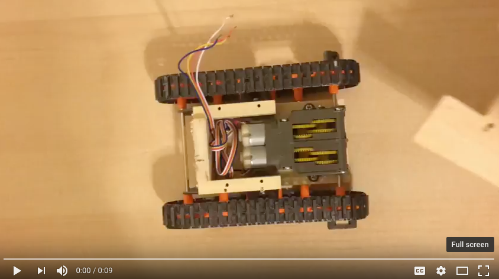](https://youtu.be/2rPZlRuI2ng)

Here is a picture of a fully assembled AutoBot:

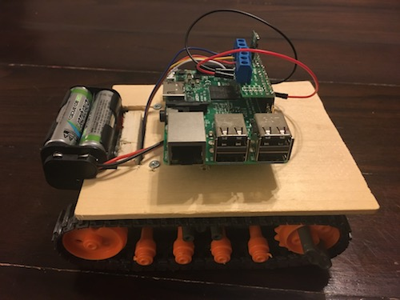


## Building the AutoBot
AutoBot consists of a converted Tamiya 70104 Remote Control Bulldozer and a Raspberry PI. We used the bulldozer as the basic vehicle platform on top of which we placed a the PI with a battery pack. 

### Hardware List
[Tamiya 70104 Remote Control Bulldozer - ](https://www.amazon.com/Tamiya-70104-Remote-Control-Bulldozer/dp/B002DR3H4Y/ref=sr_1_1?ie=UTF8&qid=1508616370&sr=8-1&keywords=tamiya+remote+control+bulldozer)
This is the robot's vehicle. The kit includes the chassis with wheels, tracks, and 2 motors.

[Raspberry Pi 3 model B - ](https://www.pololu.com/product/2759)
Raspberry runs the code that takes the instructions from a remote controller and converts them to signals for motors. 

[Pololu DRV8835 Dual Motor Driver Kit for Raspberry Pi - ](https://www.pololu.com/product/2753)
The motor driver enables it to connect and power the motors with the PI. 

[Pololu 5V Step-Up/Step-Down Voltage Regulator S7V7F5 - ](https://www.pololu.com/product/2119)
The voltge regulator allows us to power the PI from an external battery back without having to use the USB. 

[ Battery Holder for 4 x AA batteries - ](https://www.amazon.com/gp/product/B01381A020/ref=oh_aui_detailpage_o01_s00?ie=UTF8&psc=1)
Battery holder gives us the ability to use regular AA batteries to power the vehicle and connect them to the PI.

### Vehicle Assembly
We start with the assembly of the Tamiya vehicle. The kit comes with very good [assembly instructions.](documentation/images/70104ml.pdf) The cool thing about this kit is that one gets to assemble everything including the gearbox. When assembled, the vehicle will look like the image below. 


*Note: Before proceeding with adding the Raspberry PI, we recommend that basic operation of the vehicle is tested using the wired remote control.*

At this point the vehicle will look like the below image. (*Note, we didn't bother to add the bulldozer blade and arms.*)
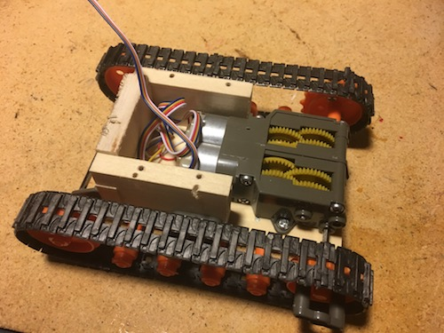

Unfortunately, the kit itself does not come with some kind of platform where we could mount our PI, so we created a crude one from a piece of thin wooden sheet. We'll use this sheet to mount the PI on.

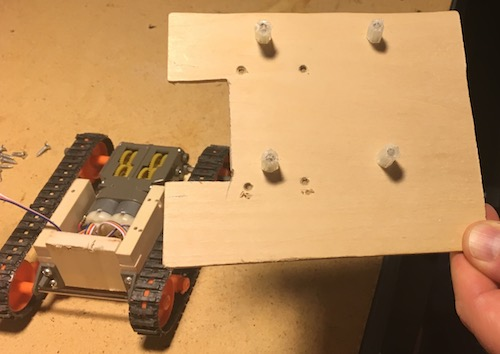

Mounting the cover:

[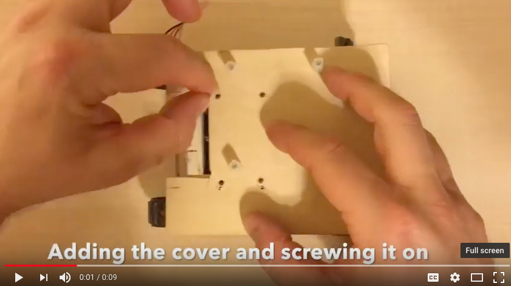](https://youtu.be/eSt4e-zv4_Y)


 Mounting the Raspberry PI:
 
[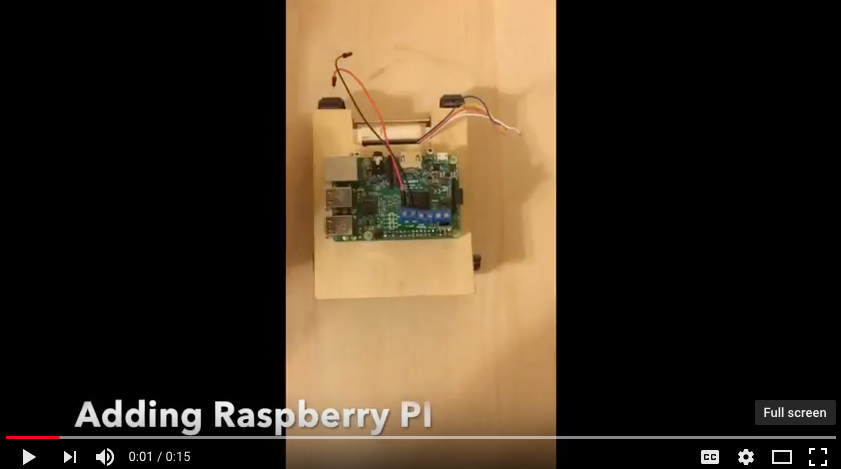](https://youtu.be/vQb2U8MfU38)


Wiring in the motors:

[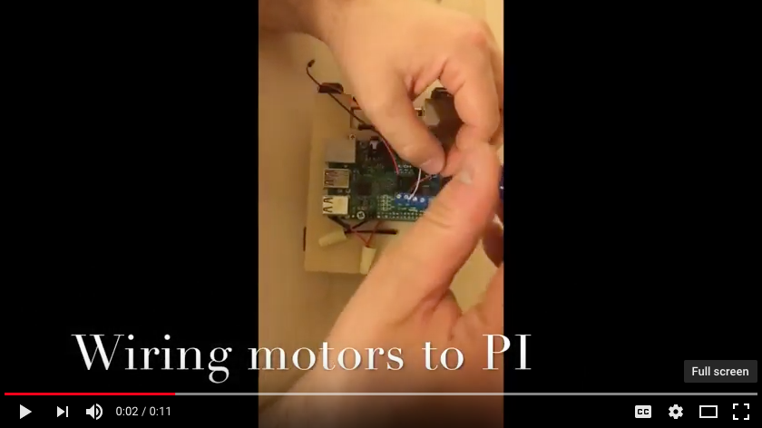](https://youtu.be/f5gJqShwAnU)

Here is how to wire the motor wires to the terminal blocks. The left most wires (red and black) are power from the battery pack, while the white, red, and blue are for the motors. 
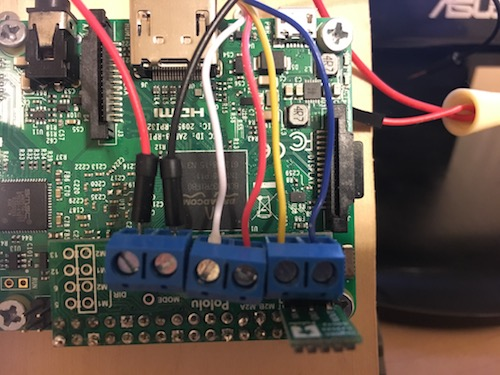


### Raspberry PI Assembly

#### Motor Drivers
Unfortunatelly, the Raspberry PI does not come ready to drive the motors. In order to do that, we need to add in the motor driver and the voltage regulator. 

The Pololu motor driver needs to be assembled. It comes with several components including the circuit board, the GPIO female headers, and three 2-pin terminal blocks. Once soldered, the component can be placed on the Raspberry PI and wired to the motors. 

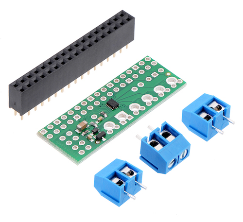

Here are instructions all the key information about the motor driver: 
[Pololu DRV8835 Dual Motor Driver Kit for Raspberry Pi](https://www.pololu.com/product/2753)

#### Voltage Regulator
The AutoBot is powered by an external battery. By adding the voltage regulator to the motor drivers, we can both power the motors and the entire Raspberry PI from a single power source. 

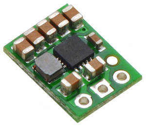

 The voltage regulator will need to be soldered onto the motor driver. Here are instructions all the key information about voltage regulator:
[Pololu 5V Step-Up/Step-Down Voltage Regulator S7V7F5](https://www.pololu.com/product/2119)


## Software
There are several software components that make the robot work. Most of it is written in Python3, and some in html/javascript. 

### Client Robot
The python program running on the robot is called clientRobot.py. When executed, the code will connect to the server and await instructions. 

### Controller
The remote controller is a mobile friendly webpage that uses javascript and webSockets to connect to the server and send instructions such as moving the robot forward, backward, left, right or stopping it. When the user taps a command button, the code will send the instructions to the server, which will pass them to the robot. 

### Server 
The server will wait for the instructions from the controller and pass them along to the robot. The server actually runs 3 different python applications:
#### server.py 
This is the main server. It listens on a TCP socket for a specific JSON message from the controller. It then passes the message to the already connected robot. Robot also connects to the server via a TCP socket.

#### serverWebSocket.py
This server listens for a message from the controller’s javascript client using a webSocket. When it receives a message, it will connect to the main server (server.py) via a socket and send the message. 

#### serverWeb.py
This is simply a static web server that serves the login and the controller page. 

### Architecture
Here is the overall architecture that depicts the interaction of the controller, servers, and the robot.

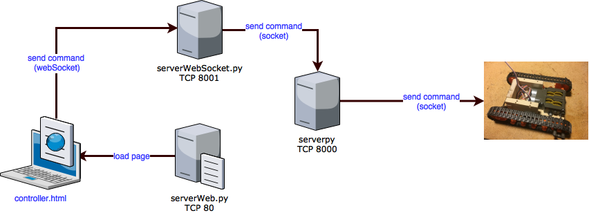


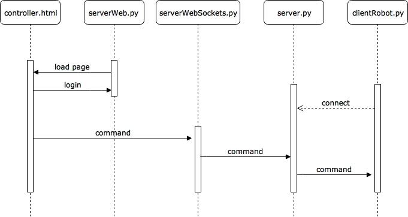

### Python Libraries
Web Socket server: https://github.com/dpallot/simple-websocket-server 

Pololu Motor Driver: https://github.com/pololu/drv8835-motor-driver-rpi

### Modules used
* BaseHTTPServer
* collections
* enum
* flask
* http.server
* io
* modules.pololu_drv8835_rpi
* pololu_drv8835_rpi
* select
* SimpleWebSocketServer
* StringIO
* threading
* base64
* codecs
* errno
* hashlib
* json
* logging
* os
* os.path,sys
* queue
* socket
* socketserver
* ssl
* struct
* sys
* threading
* time
* traceback
* wiringpi

### External modules to install
* flask
* python-socketio


### Settings
#### settings.py
Settings file in settings/settings.py governs various server and client settings including the ip addresses and TCP ports the servers and clients use. 
``` python 

    HOST = "0.0.0.0"                            #local host used to bind locally
    HOST_REMOTE = "192.168.1.143"               #DEV remote host used to bind remotely 
    #HOST_REMOTE = "52.176.147.178"               #PROD remote host used to bind remotely 
    PORT = 8000                                 #TCP port for the first server
    APP_ID = "123adalsdjfhaldfjkahl234234234"   #app id for security
    LOGGING_LEVEL = logging.DEBUG               #logging level
    ADMIN_USER = "admin"                        #controller admin username
    ADMIN_PASS = "autobotfun"                   #controller admin password

```

#### settings.js
This file is used by the javascript based controller. 
```javascript

var config = {
    connection: 'ws://192.168.1.143:8001'     //development server
  };
```

### How to start everything
The robot and the server code is architected so the controller and the robot don't require to be on the same network or even know each other's IP addresses or host names. All they need to know is the server IP address that's configured in settings.py using HOST_REMOTE. As long as the server IP address is accessible by both the controller and the robot, everything will work. To test the robot and the controller, we simply found out the local IP address of the test machine the server code (server.py, serverWebSocket.py, and serverWeb.py) is running on. We then started all of the server components. Afterwards, we started the robot, which then connected to the server. Lastly, we went to the HOST_REMOTE IP address using a browser and logged in to the controller.

#### Run the code
Below image shows commands that will start the various server components. The first thre need to run on a server, while the last needs to run on the robot. 

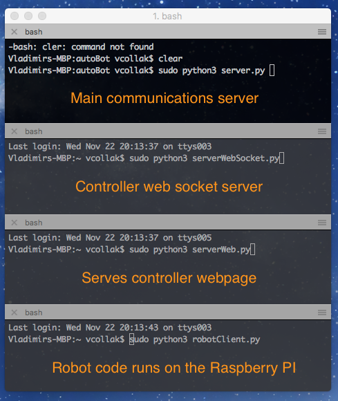
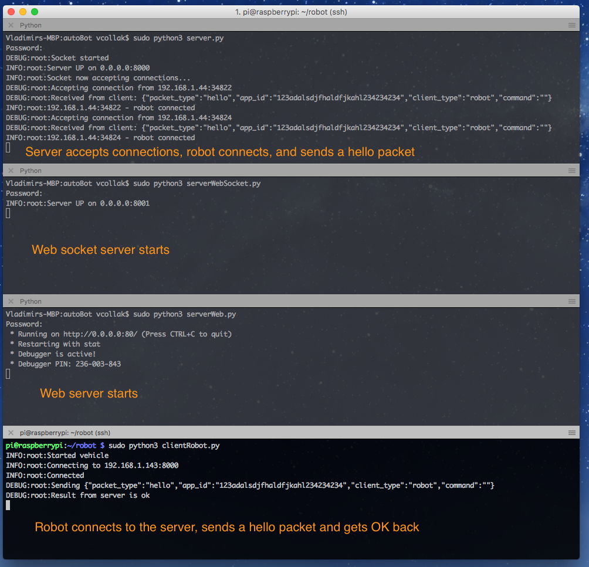

This is what sending a forward command should look like. At this point the robot should be moving forward.
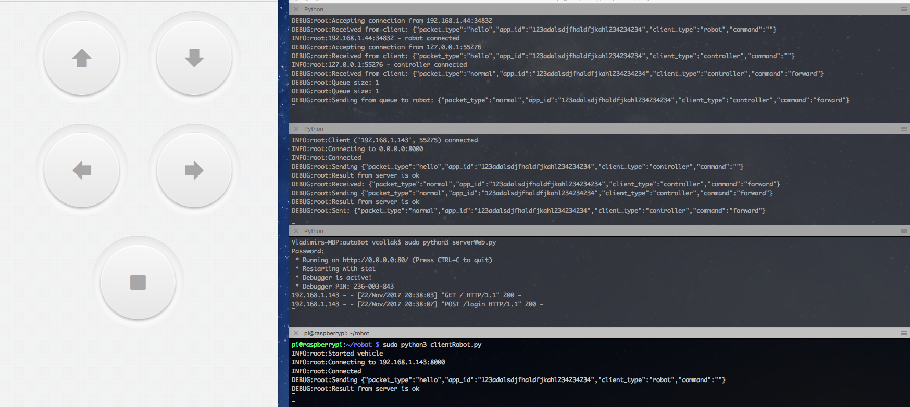

#### Controller Authentication (default)
By default, users can authenticate to the controller using below credentials. ** If you're going to host this on the web outside of your test network, we strongly recommend that you change the password in settings.py **

**Username:** admin
**Password:** autobotfun


#### Hosting
If you want to run this outside of your test network, you will have to host the server code somewhere in the web. We ran this on Microsoft Azure using a Linux virtual machine. Don't forget to find the outside server IP address and configure both settings.py and settings.js accordingly. 